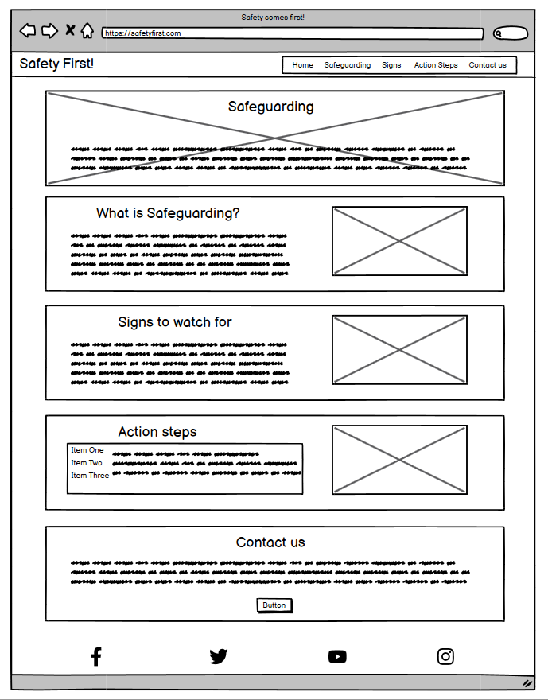
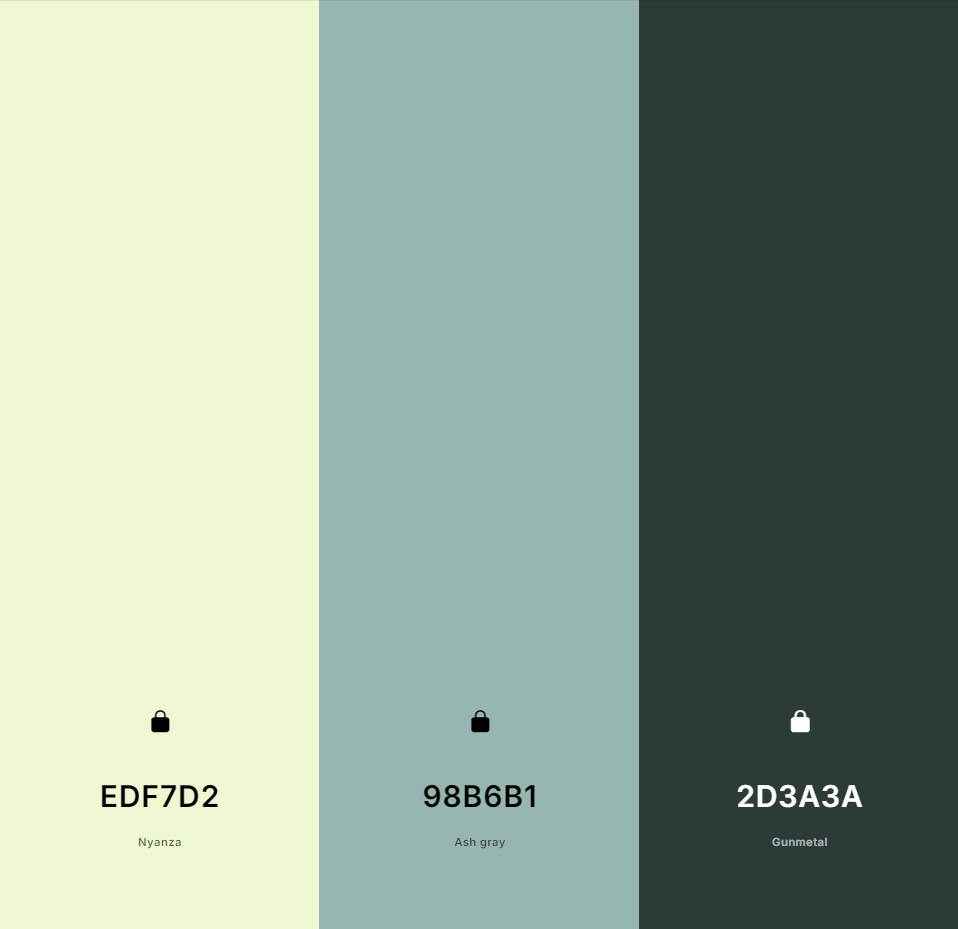
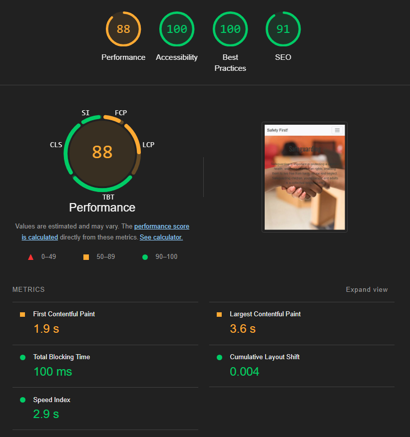

# Safety First!
[View the live project here](https://ashrafur93.github.io/safety-first/)

## Overview
Safety First! is a website with a straightforward webpage that outlines the key principles of safeguarding using clear, structured content with basic HTML and CSS. The layout is simple and intuitive, making the information easy to access and understand.

## User Experience (UX)
The user seeks clear, easy-to-understand information on safeguarding practices, including how to recognize and respond to safeguarding concerns.

## Design
### Wireframe
The wireframe was built in Balsamiq, although the final style was not kept due to time constraints.

### Colour scheme
The choice of colours was taken from coolers.com

## Technologies used
### Languages
- HTML5
- CSS3

### Frameworks, libraries and programs
- Bootstrap 5.3.3
- Code Insitute LMS - for previous study content which was used in this project
- Balsamiq - for wireframing
- Git - for version control
- Github - for project repository
- Font Awesome - for social icons at the footer
- Google Fonts - for custom fonts
- Microsoft Copilot - for assistive coding
- W3C HTML Validator - for validation of code
- W3C CSS Validator - for validation of code
- Pexels.com - for stock images
- squoosh.app/editor - for converting jpeg files into webp files

## Deployment
Github Pages was used to deploy this project:
1. Navigate to the project: safety-first
2. Click Settings at the top.
3. Click on Pages on the left-hand side.
4. Select Main in Branch.
5. Click save.

## Testing
### W3C HTML validation

### W3C CSS validation

### Lighhouse testing

## Credits
### Content
The following websites were used for text content.
- https://www.nhs.uk/conditions/social-care-and-support-guide/help-from-social-services-and-charities/abuse-and-neglect-adults-at-risk/
- https://www.england.nhs.uk/long-read/safeguarding/
- https://www.england.nhs.uk/safeguarding/about/

### Previous cohorts' submissions
These were used for inspiration on content structure and design, including the README.md files.
- m-dixon5/CyberWise-Project
- laurachri-hall/project-1-safeguarding-bgg
- TaylaJBall/Minds-Together

## Known bugs
- The send button from the contact form sends the user back to Action Steps. 

## Future improvements
- Add a hover effect to navigation buttons and submit button for improved UX.
- Design information cards to be as originally intended during wireframing.